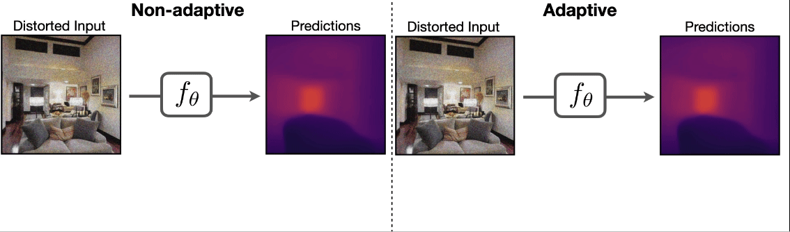

# Rapid Network Adaptation: Learning to Adapt Neural Networks Using Test-Time Feedback [ICCV 2023] <!-- omit in toc -->
[Teresa Yeo](https://aserety.github.io), [Oguzhan Fatih Kar](https://ofkar.github.io/), [Zahra Sodagar](https://https//ir.linkedin.com/in/zahra-sodagar-a576141b8?), [Amir Zamir](https://vilab.epfl.ch/zamir/)

 [`Website`](https://rapid-network-adaptation.epfl.ch/) | [`arXiv`](https://arxiv.org/abs/2309.15762) | [`BibTeX`](#citation)


<div align="center" style="padding: 0 100pt">

</div>

## Summary  <!-- omit in toc -->

Neural networks are unreliable against distribution shifts. Examples of such shifts include blur due to camera motion, object occlusions, changes in weather conditions and lighting. Dealing with such shifts is difficult as they are numerous and unpredictable. Therefore, training-time strategies that attempt to take anticipatory measures for every possible shift (e.g., augmenting the training data or changing the architecture with corresponding robustness inductive biases) have inherent limitations. This is the main motivation behind test-time adaptation methods, which instead aim to adapt to such shifts as they occur. In other words, these methods choose adaptation over anticipation. In this work, we propose a test-time adaptation framework that aims to perform an efficient adaptation of a main network using a feedback signal.


## Table of Contents <!-- omit in toc -->
   * [Installation](#installation)
   * [Download pre-trained models](#pretrained-models)
   * [Train a model](#training)
   * [Citing](#citation)


## Installation 
The code can also be run using a Python environment manager such as Conda. See [requirements.txt](./requirements.txt) for complete list of packages. We recommend doing a clean installation of requirements using virtualenv:
1.  Clone the repo:
```bash
git clone https://github.com/EPFL-VILAB/RapidNetworkAdaptation.git
cd RapidNetworkAdaptation
```

2. Create a new environment and install the libraries:
```bash
conda create -n rnaenv -y python=3.8
conda activate rnaenv
pip install -r tools/requirements.txt
```

## Pretrained models

#### Network Architecture
All networks are based on the [UNet](https://arxiv.org/pdf/1505.04597.pdf) architecture. They take in an input size of 256x256, upsampling is done via bilinear interpolations instead of deconvolutions. All models were trained with a l1 loss. Architectural hyperparameters for the models are detailed in [transfers.py](./transfers.py).


#### Download the models
The following command downloads the pretrained model.
```bash
sh ./tools/download_models.sh
```

This downloads the `single UNet baseline` model for `depth_zbuffer` targets to a folder called `./pretrained_models/`. The trained RNA model can be downloaded [here](https://drive.switch.ch/index.php/s/QQ73VIZUpzCZBG1).


## Training

Assuming that you want to train on the full dataset read on.

The pretrained and final models are provided [here](#download-the-models).

#### Code structure
```python
config/             # Configuration parameters: where to save results, etc.
    split.txt           # Train, val split
    jobinfo.txt         # Defines file paths for training data
modules/            # Network definitions
train.py            # Script for training controller network
dataset.py          # Creates dataloader
energy.py           # Defines path config, computes total loss, plots 
models.py           # Implements forward backward pass
graph.py            # Computes path defined in energy.py
task_configs.py     # Defines task specific preprocessing, masks, loss fn
transfers.py        # Defines models
augs_depth.py       # Simulates noisy sparse depth from SFM
utils.py            # Extracts file paths for training data
```

**Train RNA**

To train the controller network, $h_\phi$, the command is given by

```bash
python train.py baseline_depth_loop_film --run_name {run_name} 
```

## Citation

If you find the code, models, or data useful, please cite this paper:

```
@inproceedings{yeo2023rapid,
  title={Rapid Network Adaptation: Learning to Adapt Neural Networks Using Test-Time Feedback},
  author={Yeo, Teresa and Kar, O{\u{g}}uzhan Fatih and Sodagar, Zahra and Zamir, Amir},
  booktitle={Proceedings of the IEEE/CVF International Conference on Computer Vision},
  pages={4674--4687},
  year={2023}
}
```
